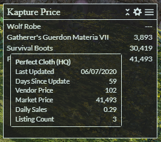

## DEPRECATION NOTICE

ACT Kapture has been officially deprecated and will no longer be supported.
A new version of Kapture has been released as an XIVLauncher plugin with more features and better performance!
Check out the Quick Launcher here: https://github.com/goatcorp/FFXIVQuickLauncher. You can install Kapture through the in-game plugin installer.

<h1 align="center">
   
   kapture price 
</h1>
<h4 align="center">FFXIV ACT Kapture Overlay</h4>

  
  

## Background

kapture price is a loot overlay for use with ACT for FFXIV and the Kapture plugin. This overlay shows market board data for any items you obtain or search for. Market board data is <a href="https://universalis.app/">powered by Universalis</a>.

## Preview

## Key Features

* Shows market board average for obtained items.
* Shows market board average for items you search for.
* Shows high-quality or normal-quality average based on item.
* Click on an item to view additional info including vendor price.
* Customize layout including how numbers are displayed.
* Customize how many items display and to exclude duplicates.
* Filter out old upload data (default is 60 days).
* Support for English, French, German, and Japanese.

## How To Install

* Refer to instructions on the <a href="https://github.com/kalilistic/kapture">Kapture repository</a>.
* Ensure market board data is enabled in Kapture.
